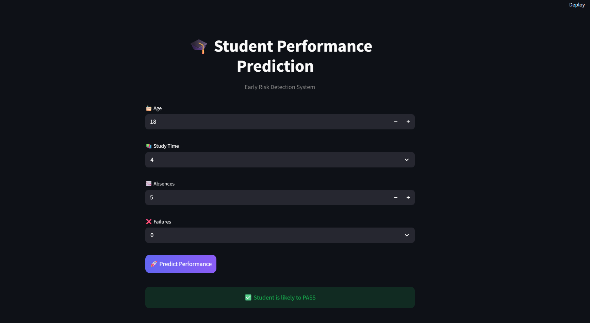
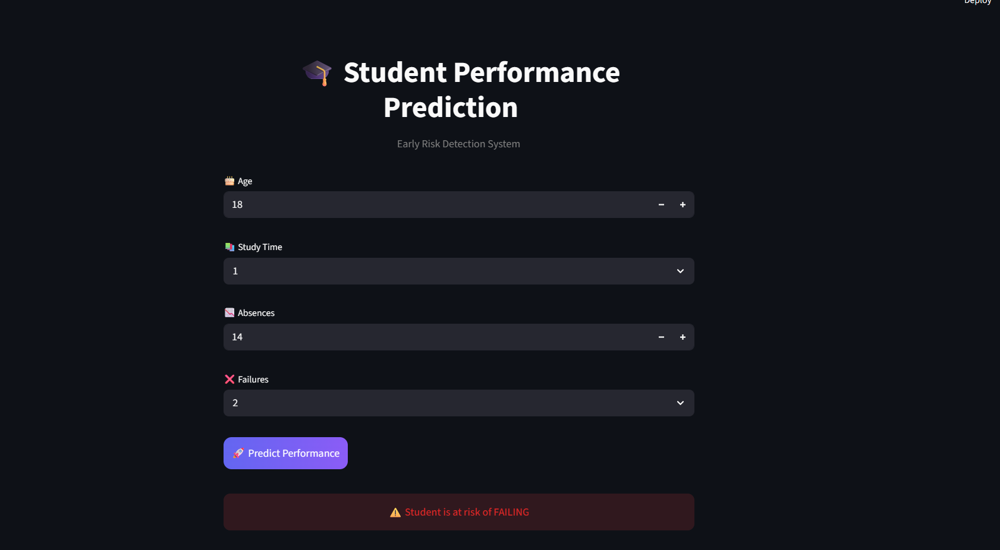

# Student Performance Prediction and Early Intervention

## Problem Statement

The goal of this project is to predict whether a student will pass or fail based on demographic, academic, and behavioral factors. Early identification of at-risk students enables timely intervention and improves academic outcomes.

---

## Objectives

- Predict student performance (Pass/Fail)
- Identify at-risk students early
- Compare multiple machine learning models

---

## Dataset

This project uses the UCI Student Performance Dataset.

The dataset includes:
- Demographic information
- Academic details (study time, failures, absences)
- Grades (G1, G2, G3)

### Target Variable

Final grade (G3) is converted into:

- Pass (1) → G3 ≥ 10  
- Fail (0) → G3 < 10  

---

## Project Pipeline

### 1. Data Understanding
- Explored dataset structure
- Checked missing values and duplicates

### 2. Data Preprocessing
- Created target variable (Pass/Fail)
- Removed data leakage features (G1, G2, G3)
- Encoded categorical variables
- Performed train-test split

### 3. Exploratory Data Analysis (EDA)
- Pass vs Fail distribution
- Study time vs performance
- Absences vs performance
- Correlation analysis

---

## Model Training and Evaluation

Three models were trained and evaluated:

### Logistic Regression (Best Model)
Accuracy: 0.759  

### Decision Tree
Accuracy: 0.709  

### Gradient Boosting
Accuracy: 0.696  

Logistic Regression achieved the best performance and was selected for deployment.

---

## Web Application

A Streamlit application is developed to:

- Accept user inputs:
  - Age
  - Study time
  - Absences
  - Failures
- Predict whether a student will pass or fail

### Files

- app.py → Streamlit application  
- model.pkl → trained model  
- columns.pkl → feature columns used for prediction  

---

## Project Structure
student-performance-prediction/
│
├── 01_data_understanding.ipynb
├── 02_data_preprocessing.ipynb
├── 03_eda.ipynb
├── 04_model_training_&_evaluation.ipynb
│
├── app.py
├── model.pkl
├── columns.pkl
│
├── images/
│ ├── resultimg1.png
│ └── resultimg2.png
│
└── README.md

---

## Technologies Used

- Python  
- Pandas, NumPy  
- Scikit-learn  
- Matplotlib, Seaborn  
- Streamlit  

---

## Key Insights

- Study time positively impacts performance  
- Past failures strongly influence outcomes  
- Absences negatively affect results  
- Student performance depends on multiple factors  

---

## Conclusion

Logistic Regression achieved the highest accuracy among the tested models and was selected for deployment. The developed web application enables quick prediction of student performance and helps identify at-risk students.

---

## Application Preview

---

## Live Application

https://student-performance-prediction-and-early-intervention-st6pqzxw.streamlit.app/
