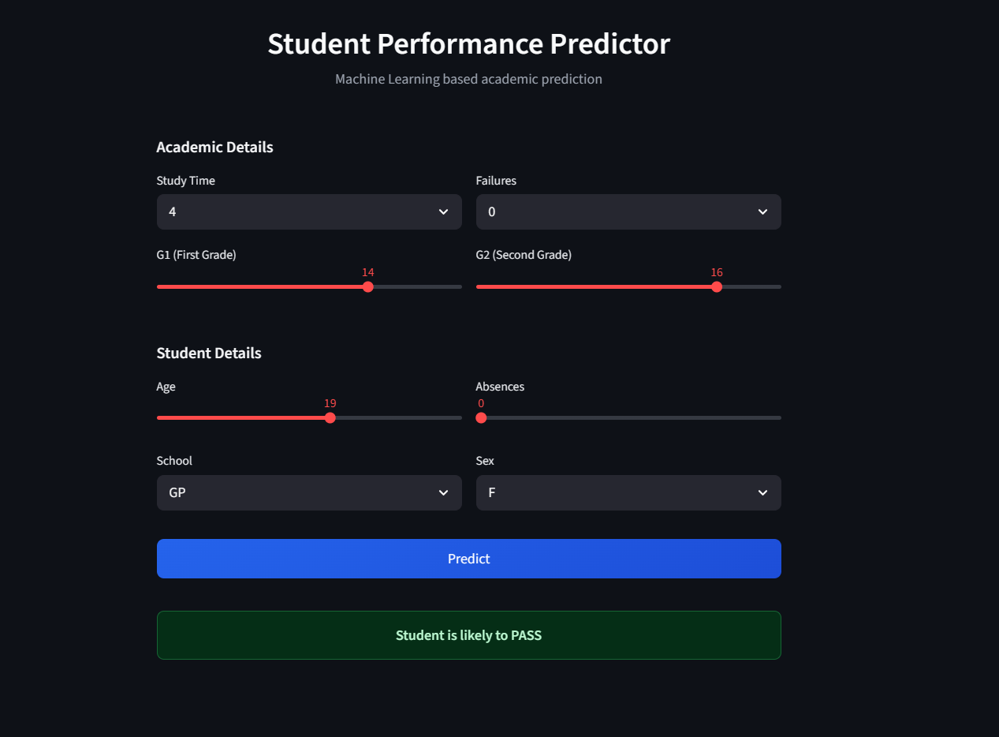
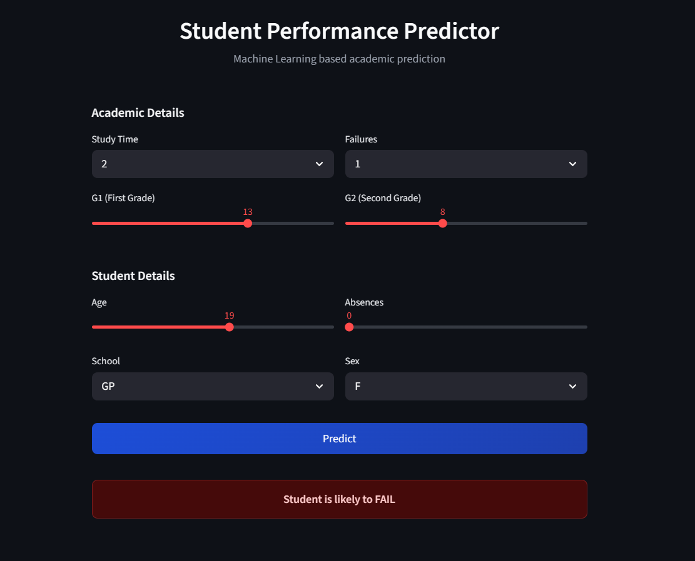

# 🎓 Student Performance Prediction & Early Intervention

## Problem Statement

The objective of this project is to predict whether a student is likely to pass or fail based on academic and behavioral factors, enabling early identification of students who may need support.

---

## Dataset

- UCI Student Performance Dataset  
- Contains demographic and academic features  

### Target

- Pass (1) and Fail (0) derived from final performance  

---

## Approach

- Data preprocessing and encoding  
- Exploratory data analysis  
- Model training and evaluation  
- Deployment using Streamlit  

---

## Model

- **Random Forest (Best Model)**  
- Accuracy: **0.91**

---

## Web Application

The application takes inputs such as:

- Age  
- Study Time  
- Failures  
- Absences  
- G1, G2  

and predicts:

- **Student is likely to PASS**  
- **Student is likely to FAIL**

---

## Technologies Used

- Python  
- Pandas  
- Scikit-learn  
- Streamlit  

---

## Application Preview

### PASS Prediction

### FAIL Prediction

---

## Live Application

https://student-performance-prediction-and-early-intervention-st6pqzxw.streamlit.app/
